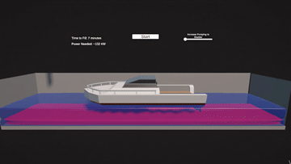
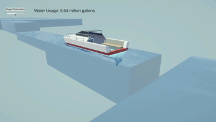

# Goldilocks

Goldilocks is a **Department of Defense**–sponsored project developed under the University of Central Florida’s Entrepreneurship for Defense course, in collaboration with SOUTHCOM, the Defense Innovation Unit (DIU), and a multidisciplinary student engineering team. The project focused on freshwater conservation in the Panama Canal. 

This repository serves as the central hub for my contributions to the Goldilocks project.

---

### 1. Panama Canal Displacement Analysis
[**Panama Canal Data Repository**](https://github.com/jleto6/panama-canal-data)  

A **Python**-based tool for modeling freshwater efficiency in Panama Canal lock operations.  

**Features**  
- Estimates water usage per transit for Panamax and Neopanamax locks.  
- Calculates displacement, water loss, and per-cycle costs using **NumPy**.  
- Implements a **greedy scheduling algorithm** to batch smaller ships into shared lock cycles.  
- Produces visualizations of water loss, savings, and efficiency tradeoffs with **Jupyter + Matplotlib**.  

---

### 2. Bladder Simulation Tool
  
[View source code](https://github.com/josephletobar/bladder-sim)  

A **C#** Unity simulation that visualizes a bladder-inspired water retention concept.  
This tool was built in response to a request from a Department of Defense sponsor, who asked the team to explore the feasibility of an inflatable bladder mechanism for reducing freshwater loss in canal operations. 

**Features**  
- Models bladder expansion and contraction in canal lock.  
- Demonstrates power consumption and time delays under different operation scenarios.  

---

### 3. Canal Simulation Tool
  
[View source code](https://github.com/josephletobar/canal-sim)  

A lightweight **C#** Unity simulation of the Panama Canal’s lock and lake system. Designed for conceptual understanding rather than physical-scale accuracy, supporting stakeholder communication.

**Features**  
- Visualizes ship movement, water flow, and lock elevation changes.  
- Illustrates Gatun Lake’s role as a freshwater reservoir.  
- Demonstrates lock operations with simplified mechanics for clarity.  
